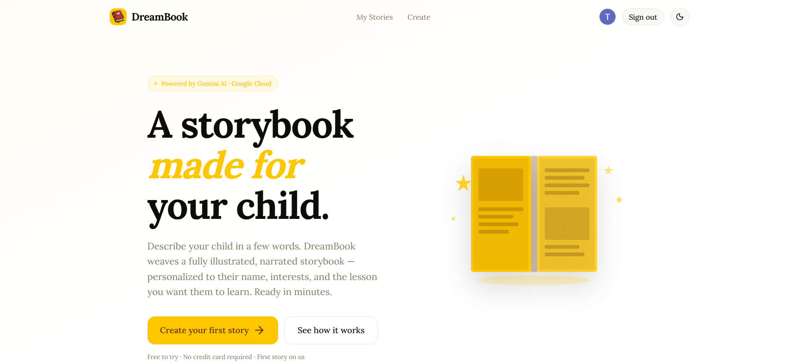

# DreamBook Web 🌟

> **Next.js frontend for DreamBook** — an AI-powered personalized children's storybook generator.
> Built for the **Gemini Live Agent Hackathon 2026**.
>
> 🏆 **Live Demo:** https://dream-book-web.vercel.app
> 📡 **Backend API:** https://github.com/your-username/dream-book-api

---

## What is DreamBook?

A parent describes their child — by voice or text — and DreamBook generates a fully illustrated, narrated, personalized storybook in real time. Pages stream in live as they're written, illustrations appear as they're generated, and audio narration plays per page. The finished story downloads as a PDF storybook.
## DreamBook Web 

---

## Tech Stack

| Layer | Technology |
|---|---|
| Framework | Next.js 15 (App Router) |
| Language | TypeScript |
| Styling | Tailwind CSS + Shadcn UI |
| Animations | Framer Motion |
| Auth | Firebase Authentication (Google OAuth) |
| Voice Input | Web Audio API (PCM capture) → Socket.io → Gemini Live API |
| Story Streaming | `fetch()` + `ReadableStream` (SSE with auth headers) |
| State Management | React `useState` / `useRef` — no external library needed |
| Deployment | Vercel (automatic on push to main) |

---

## Features

- **Voice-first story creation** — speak naturally to describe your child; Gemini Live API transcribes in real time
- **Live book assembly** — pages appear one by one as Gemini generates them
- **Split-view reader** — illustration left, text right, alternating per page
- **Audio narration** — every page has a play button for warm TTS narration
- **PDF download** — completed stories export as a landscape storybook PDF
- **Story library** — all generated stories saved to your account
- **Dark mode** — full light/dark theme support via Shadcn
- **Multilingual** — stories in 15+ languages

---

## DreamBook Architecture 


## App Structure

```
app/
├── layout.tsx                    ← AuthProvider + Playfair Display font
├── page.tsx                      ← Landing page (public)
├── login/page.tsx                ← Google OAuth sign-in
├── create/page.tsx               ← Voice-first story creation wizard
├── book/[id]/page.tsx            ← Live split-view book reader (SSE)
└── library/page.tsx              ← Story grid with delete

components/
├── auth/
│   ├── auth-provider.tsx         ← Firebase auth context (useAuth hook)
│   └── auth-guard.tsx            ← Redirects unauthenticated users
├── story/
│   ├── voice-recorder.tsx        ← Mic button + waveform + live transcript
│   └── story-confirm-form.tsx    ← Review/edit extracted story details
└── ui/
    └── app-nav.tsx               ← Unified navbar (landing + app states)

hooks/
├── use-voice-input.ts            ← AudioWorklet PCM capture → NestJS WS
└── use-story-stream.ts           ← SSE async iterator → live page state

lib/
├── firebase.ts                   ← Firebase client initialization
├── api.ts                        ← All API calls + SSE stream iterator
└── types.ts                      ← Shared types (mirrors backend schemas)
```

---

## User Flows

### Authentication
```
/login → Google Sign-In popup → Firebase issues ID token →
AuthProvider stores user → redirect to /library
```

### Create a Story
```
/create
  ├─ Step 1: Voice Input
  │   └─ Tap mic → AudioWorklet captures PCM 16kHz
  │   └─ Chunks sent via Socket.io to NestJS /voice gateway
  │   └─ Gemini Live API transcribes in real time
  │   └─ On stop: Gemini extracts structured StoryRequest JSON
  │   └─ Live transcript shown as user speaks
  │
  └─ Step 2: Confirm Details
      └─ Pre-filled form with extracted values
      └─ Edit name, age, interests, lesson, page count, style, language
      └─ Click Generate → POST /api/stories → get storyId
      └─ Redirect to /book/:id
```

### Live Book Viewer
```
/book/:id
  └─ Opens SSE stream → fetch() with Authorization header
  └─ page:text events → page appears immediately with skeleton image
  └─ page:image events → illustration fades in when Nano Banana finishes
  └─ page:audio events → narration player appears per page
  └─ story:complete → PDF download button appears
  └─ Alternating layout: image-left/text-right, image-right/text-left
```

### Story Library
```
/library
  └─ Waits for Firebase auth state (avoids "Not authenticated" on load)
  └─ Fetches all stories for current user
  └─ 4-column grid with cover image, status badge, interests tags
  └─ Hover → delete button appears
  └─ Click → opens book viewer
```

---

## Local Development

### Prerequisites

- Node.js 20+
- Firebase project with Google Auth enabled
- DreamBook API running locally (see [dream-book-api](https://github.com/your-username/dream-book-api))

### Setup

```bash
# 1. Clone
git clone https://github.com/Talha-Tahir2001/dream-book-web
cd dream-book-web

# 2. Install dependencies
npm install

# 3. Configure environment
cp .env.local.example .env.local
# Fill in all values (see Environment Variables below)

# 4. Start dev server
npm run dev
# App available at http://localhost:3000
```

---

## Environment Variables

Create `.env.local` in the project root:

```bash
# ── Firebase (client-side) ───────────────────────────────────
# Firebase Console → Project Settings → General → Your apps → SDK config
NEXT_PUBLIC_FIREBASE_API_KEY=AIzaSy...
NEXT_PUBLIC_FIREBASE_AUTH_DOMAIN=your-project.firebaseapp.com
NEXT_PUBLIC_FIREBASE_PROJECT_ID=your-project-id
NEXT_PUBLIC_FIREBASE_STORAGE_BUCKET=your-project.appspot.com
NEXT_PUBLIC_FIREBASE_MESSAGING_SENDER_ID=123456789012
NEXT_PUBLIC_FIREBASE_APP_ID=1:123456789012:web:abc123

# ── NestJS Backend ───────────────────────────────────────────
# Local dev: http://localhost:8000
# Production: your Cloud Run URL
NEXT_PUBLIC_API_URL=http://localhost:8000
NEXT_PUBLIC_WS_URL=http://localhost:8000
```

### Where to get each value

| Variable | Source |
|---|---|
| `NEXT_PUBLIC_FIREBASE_*` | Firebase Console → Project Settings → Your apps → Web app SDK config (all 6 values from one screen) |
| `NEXT_PUBLIC_API_URL` | `http://localhost:8000` locally, Cloud Run URL in production |
| `NEXT_PUBLIC_WS_URL` | Same as `NEXT_PUBLIC_API_URL` |

### Why `NEXT_PUBLIC_` prefix?

Next.js only exposes environment variables to the browser if they start with `NEXT_PUBLIC_`. Since Firebase and API calls happen in client components, all variables need this prefix.

---

## Firebase Setup

### 1. Create a Firebase project
Go to https://console.firebase.google.com → Add project → link to your existing GCP project.

### 2. Enable Google Sign-In
Firebase Console → Authentication → Sign-in method → Google → Enable.

### 3. Add authorized domains
Firebase Console → Authentication → Settings → Authorized domains → Add:
- `localhost` (for local dev)
- `dream-book-web.vercel.app` (your Vercel URL)

### 4. Register a web app
Firebase Console → Project Settings → Your apps → Add app → Web → copy the config values into `.env.local`.

---

## Vercel Deployment

### Automatic deployment
Push to `main` → Vercel automatically builds and deploys.

### Add environment variables in Vercel
Go to **Vercel Dashboard → Your Project → Settings → Environment Variables** and add all 8 `NEXT_PUBLIC_*` variables.

> ⚠️ **Important:** After adding env vars, you must trigger a new deployment for them to take effect. The easiest way is to push a new commit.

### Production environment variables
```
NEXT_PUBLIC_FIREBASE_API_KEY          = AIzaSy...
NEXT_PUBLIC_FIREBASE_AUTH_DOMAIN      = your-project.firebaseapp.com
NEXT_PUBLIC_FIREBASE_PROJECT_ID       = your-project-id
NEXT_PUBLIC_FIREBASE_STORAGE_BUCKET   = your-project.appspot.com
NEXT_PUBLIC_FIREBASE_MESSAGING_SENDER_ID = 123456789012
NEXT_PUBLIC_FIREBASE_APP_ID           = 1:123456789012:web:abc123
NEXT_PUBLIC_API_URL                   = https://dream-book-api-xxx.us-central1.run.app
NEXT_PUBLIC_WS_URL                    = https://dream-book-api-xxx.us-central1.run.app
```

---

## Key Technical Decisions

### SSE with `fetch()` instead of `EventSource`
The native browser `EventSource` API doesn't support custom headers, so you can't send `Authorization: Bearer <token>`. The `lib/api.ts` `streamStory()` function uses `fetch()` with a `ReadableStream` reader and manually parses the `event:/data:` SSE format.

### Firebase auth race condition fix
On production (Vercel), Firebase sometimes emits `null` from `onAuthStateChanged` before rehydrating the persisted session from localStorage. The `waitForAuth()` function in `lib/api.ts` waits for a definitive user state (ignoring the first null) before making any API call, preventing the "Not authenticated" 401 errors on first load.

### AudioWorklet for PCM capture
The Web Speech API was initially used for transcription but replaced with a proper `AudioWorklet` that captures raw PCM 16kHz audio from the microphone and streams it to NestJS over Socket.io. NestJS forwards it to Gemini Live API which handles transcription server-side with Voice Activity Detection.

### Polling after SSE completion
After `story:complete` fires, the frontend polls `GET /api/stories/:id` every 5 seconds to pick up illustration URLs that arrive asynchronously. This is needed because Nano Banana generates images concurrently during the SSE stream, and some may finish after the stream closes.

---

## Component Reference

### `useVoiceInput` hook
Manages the full voice session lifecycle:
- Opens Socket.io connection to `/voice` namespace
- Starts `AudioWorklet` for PCM capture
- Streams audio chunks to NestJS → Gemini Live API
- Receives live transcripts and final `StoryRequest` result
- Cleans up mic and WebSocket on unmount

### `useStoryStream` hook
Manages SSE story streaming:
- Opens authenticated `fetch()` stream
- Parses `event:/data:` SSE format
- Upserts pages in React state as events arrive
- Starts polling after `story:complete` for async illustrations
- Exposes `pages`, `status`, `pdfUrl`, `error`

### `VoiceRecorder` component
- Animated microphone button with pulse rings when listening
- Animated waveform bars during recording
- Live transcript display
- State machine: `idle → connecting → listening → processing → done → error`

### `StoryConfirmForm` component
- Pre-filled from voice extraction
- Editable: name, age, interests (tag input), lesson, fears, page count (slider), illustration style (4 buttons), language (dropdown)
- Validates before submitting

### `BookPage` component
- Alternating layout (even pages: image left; odd pages: image right)
- Skeleton loading state while illustration generates
- Smooth fade-in when image URL arrives
- `AudioPlayer` per page with progress bar

---

## Hackathon Submission Notes

**Category:** Creative Storyteller ✍️

**What makes DreamBook memorable for judges:**
1. The live book assembly — watch pages appear one by one in real time
2. Voice input — describe your child naturally and Gemini understands
3. The personalization — it's literally about YOUR child, with their name, their interests, their world
4. The demo moment — generate a story for "Emma who loves dinosaurs" and watch a judge's face

**Multimodal inputs/outputs:**
- Input: voice (audio) → text (transcript) → structured JSON
- Output: text (narrative) + images (Nano Banana illustrations) + audio (TTS narration) + PDF (assembled storybook)

---

## License

MIT
